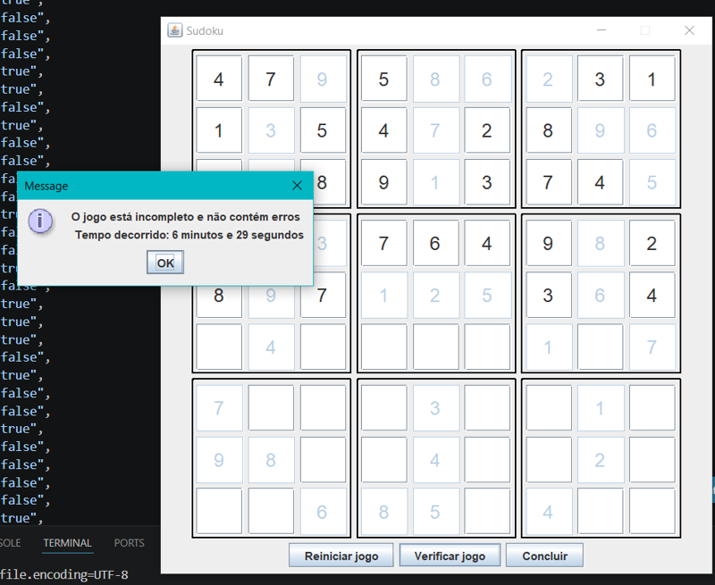
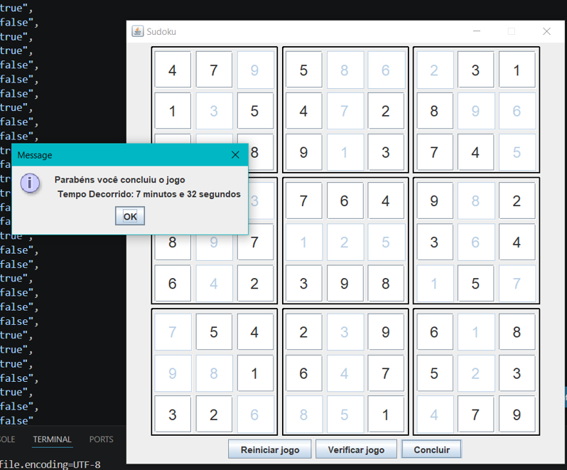

<h2>Criando um Jogo do Sudoku em Java</h2>

O repositório original pode ser acessado <a href=https://github.com/digitalinnovationone/sudoku/tree/ui/>neste link</a>.

<h3> Decisões tomadas </h3>

* Sistema Operacional Windows 10
* Gerenciar o projeto pelo VS Code 
* Usar o Maven como gerenciador de pacotes

<h3>Desafios encontrados:</h3>

* A sintaxe "Case N -> method()" não era suportada pelo JDK 11. Configurei o ambiente para rodar o projeto com JDK 17.

<h3>Alterações realizadas:</h3>

* Implementação de contagem de tempo: O tempo total será exibido quando o usuário verificar status ou concluir o jogo. 
    * Classe GameTimer fica responsável por calcular o tempo.
    * MainScreen faz a chamada à GameTimerService para obter informações sobre o tempo do jogo.

    

    

